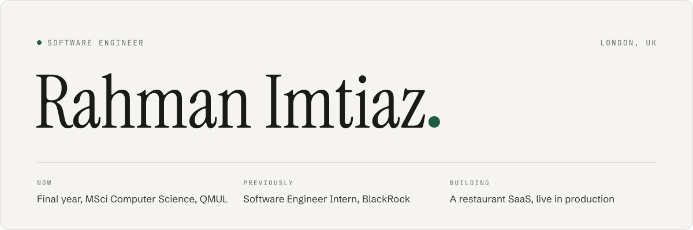

<a href="https://rahmanimtiaz.com/">
  <picture>
    <source media="(prefers-color-scheme: dark)" srcset="assets/banner-dark.svg">
    <source media="(prefers-color-scheme: light)" srcset="assets/banner-light.svg">
    
  </picture>
</a>

I'm a software engineer in London. Most of what I build lives in private repos, so the full write-ups are on my site.

### Projects

**Restaurant ordering platform** &nbsp;Next.js · tRPC · Supabase · Stripe · Kotlin 
A multi-tenant ordering platform for independent restaurants, with five apps sharing one typed API.

**Student companion app** &nbsp;FastAPI · PostgreSQL · Expo · Gemini 
My final year project: it links the meals students log to what they spend, and groups them into spending archetypes with KMeans.

**Trading bot builder** &nbsp;Tauri · Rust · Python 
A desktop app for building MetaTrader 5 trading bots through a visual editor instead of code.

**EncryptoVault** &nbsp;TypeScript · Python 
A cryptocurrency wallet for buying, selling and sending, with explanations built in for beginners.

### Contact

**[rahmanimtiaz.com](https://rahmanimtiaz.com/)** 
[hello@rahmanimtiaz.com](mailto:hello@rahmanimtiaz.com) &nbsp;·&nbsp; [LinkedIn](https://www.linkedin.com/in/rahman-imtiaz/)
